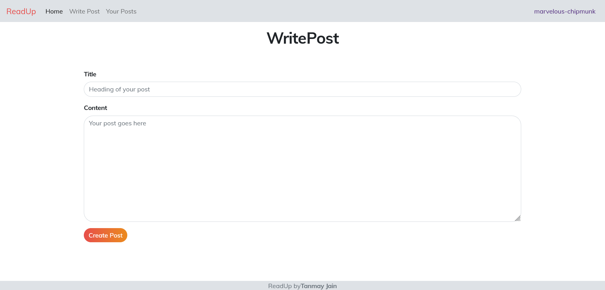
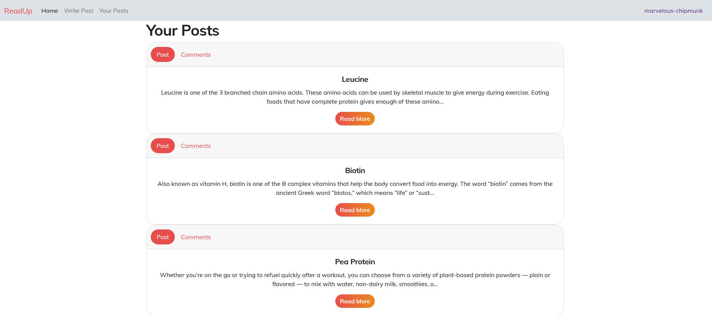
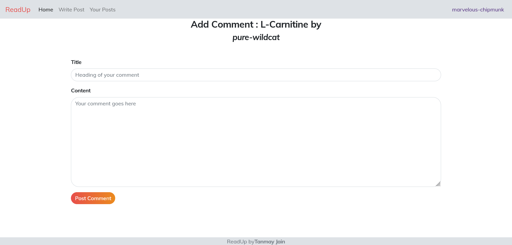

# ReadUp
**Post, Read, Comment only on ReadUp**

***
## Project Structure
***
**Backend (Server)**
```
src
├───controller
├───db
├───public
│   ├───app
│   ├───components
│   ├───css
│   ├───fonts
│   └───js
├───routes
│   ├───comments
│   ├───posts
│   └───users
└───utils
```
**Frontend (Client Side Code)**
```
public
│   index.html
│
├───app
│       allPosts.js
│       comments.js
│       common.js
│       jqueryOperation.js
│       mystyles.css
│       navbar.js
│       onePost.js
│       readMore.js
│       writePost.js
│       yourPost.js
│
├───components
│       allPosts.html
│       footer.html
│       navbar.html
│       onePost.html
│       readMore.html
│       writePostForm.html
│       yourPost.html
│
├───css
│       bootstrap.css
│
├───fonts
│       Muli-Italic.woff2
│       muli.css
│       Muli.woff2
│
└───js
        bootstrap.js
        jquery-3.6.0.js
        popper.js
```
## Business Logic
***
### Users


1. **create users** this will create a new user with a random username. example:


### Posts
1. **create post** this will create a new post, required fields are

    - username (the author of this post)
    - title
    - body
2. **show all posts** list all existing posts, we should have following filtering support
    
    - filter by username
    - filter by query contained in title (search by - title)
### Comments
1. Add a comment
2. Show all comments under the post


## API Documentation
***

### ```users ```
1. ```POST /api/users```
Creates a new user with random username and an user id
2. ```GET /api/users/{userid}```
Get the user with a given user id
3. ```GET /api/users/{username}```
Get the user with a given user-name

### ```posts ```
1. ```POST /api/posts```
Create new posts: Required fields are
    - userId
    - Title (of the new post)
    - Body (body of the post)
 
2. ```GET /api/posts/```
Get all the posts
3. ```GET /api/posts/{id OR username}```
Get all the posts by a user (required userId or userName)


### ```comments```
1. ```POST /api/comments```
Create new comment on a post: Required fields are
    - postId
    - userName (of the comment author)
    - cTitle (TITLE of the post)
    - cBody (BODY of the Post)
2. ```GET /api/comments/{pId}```
Get all the comments under a post


***


